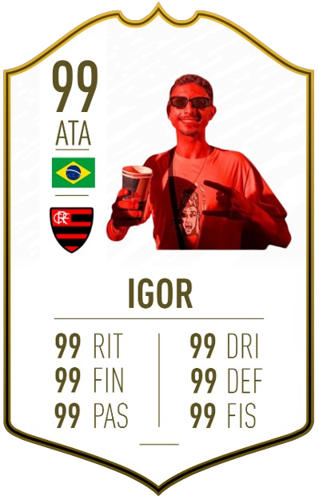
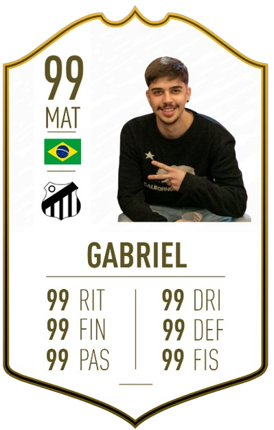
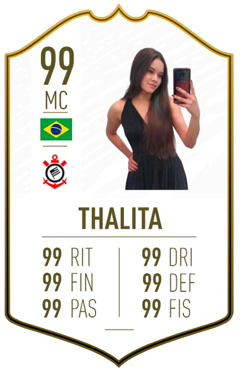

# Prevendo o valor de jogadores de futebol usando suas estatísticas do Fifa

Este trabalho faz parte do projeto de Machine Learning desenvolvido para a disciplina C318 do Instituto Nacional de Telecomunicações.

**Data: 03 de junho de 2024**

## Introdução

Perguntas que nos motivaram a realizar esse projeto:

- **É possível prever o valor de um jogador de futebol a partir de seus atributos de jogo e meta dados?**
- **Quais fatores são mais importantes para determinar o valor de mercado de um jogador?**
- **Quais jogadores estão supervalorizados ou subvalorizados em comparação com o mercado?**

Neste notebook, vamos usar um conjunto de dados de atributos de jogadores extraídos do site oficial do jogo FIFA, [www.sofifa.com](www.sofifa.com), para responder às três perguntas acima. Embora fatores como forma física do jogador e resultados da equipe possam ter um impacto de curto prazo no valor percebido de um jogador, em última análise, o valor de um jogador deve estar vinculado às suas habilidades e atributos fundamentais - quão boas são suas habilidades em comparação com outras? Ser capaz de prever o valor de cada jogador e entender os principais motores das previsões tem dois benefícios principais:

1. Equipes de futebol/olheiros podem identificar se um jogador alvo está atualmente supervalorizado ou subvalorizado e qual preço devem estar dispostos a pagar por um jogador dessa qualidade (independentemente da forma atual).
2. Entender quais fatores mais afetam o valor pode informar jogadores em crescimento quais habilidades são mais demandadas no mercado e quais habilidades eles devem focar em melhorar para aumentar seu valor.

## Premissas da Análise

Premissas principais para esta análise:

- O valor dos jogadores de futebol está correlacionado ao seu conjunto de habilidades, habilidades e metadados.
- O valor do jogador não é substancialmente impulsionado pela forma/desempenho de curto prazo (por exemplo, número de gols marcados ou jogos sem sofrer gols nos últimos 10 jogos, etc.).
- Os valores dos jogadores são consistentes/transferíveis entre diferentes ligas/países. Ou seja, o valor de cada jogador não depende da liga na qual ele joga atualmente.
- Outros fatores 'comerciais', como presença na mídia/popularidade, não afetam o valor do jogador.

## Resumo

As pontuações de atributos dos jogadores (por exemplo, passe, precisão, resistência, aceleração, etc.) e informações adicionais (por exemplo, idade, posição, potencial, etc.) foram coletadas do site SoFIFA para a temporada de 2024. Essas informações foram usadas para desenvolver um modelo para prever o valor de cada jogador. A distribuição dos valores de mercado dos jogadores é muito positivamente enviesada, com a maioria dos jogadores tendo avaliações relativamente baixas, mas com alguns jogadores excepcionais comandando um prêmio significativo. Esta variável foi transformada logaritmicamente para normalizar os dados e criar a variável alvo para modelagem - log(valor).

Inicialmente, seis modelos de regressão foram testados no conjunto completo de características (regressão linear, regressão linear múltipla, árvores de decisão, florestas aleatórias e XGBoost) usando GridSearchCV para ajustar os hiperparâmetros. O XGBoost teve o melhor desempenho com um erro quadrático médio (RMSE) de 0,18. Após interpretar a saída do modelo, os atributos individuais de jogo foram considerados estatisticamente significativos, mas não economicamente significativos. Os atributos de jogo foram combinados em categorias mais gerais para reduzir a complexidade do modelo, mas preservar algumas das informações contidas nesses recursos. Usando o algoritmo XGBoost no novo conjunto de recursos, o desempenho do modelo foi marginalmente melhor, resultando em um RMSE de 0,17.

Os valores SHAP foram usados para interpretar o modelo XGBoost, com a classificação geral, potencial do jogador e idade sendo os recursos mais importantes. A idade teve uma relação não linear com a variável alvo, com jogadores mais velhos tendo um valor de mercado previsto significativamente menor. Das características de habilidades, habilidades de ataque (cruzamento, finalização, passe curto, etc.) foram as mais importantes para aumentar o valor previsto.

O modelo foi usado para identificar jogadores ingleses subvalorizados e supervalorizados. Os jogadores supervalorizados incluíam nomes famosos e/ou jogadores que jogaram para grandes clubes no passado. Isso sugere que popularidade/reputação, que não foi incluída como um recurso, pode inflar o valor dos jogadores além de sua habilidade fundamental.

------------------------

# Conteúdo

**[1. Análise Exploratória de Dados](#eda)**  
**[2. Modelagem](#modeling)**  
**&nbsp;&nbsp;[2.1 Preparação de Dados](#data_prep)**  
**&nbsp;&nbsp;[2.2 Modelo de Linha de Base](#baseline_model)**  
**&nbsp;&nbsp;[2.3 Regressão Linear Múltipla](#mlr)**   
**&nbsp;&nbsp;[2.4 Métodos de Aprendizado de Máquina](#ml)**   
**[3. Interpretação do Modelo](#mi)**   
**&nbsp;&nbsp;[3.1 Engenharia de Características](#fe)**  
**[4. Identificação de jogadores supervalorizados/subvalorizados](#iovp)**  
**[5. Conclusão](#conclusion)**

# Membros da Equipe

